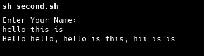

# Shell Scripting


## introduction

In shell scripting on Linux, the primary language used is Shell Script (Bash scripting), which is based on the Bash (Bourne Again Shell) programming language. Other shells like sh (Bourne Shell), zsh (Z Shell), ksh (Korn Shell), and fish (Friendly Interactive Shell) can also be used, but Bash is the most common.

### Check Which Shell Operating Right Now ?

```
cat /etc/shells
```

### Add File Permission to execute

```
chmod +x <-filename->
```

### Run The ShellScript File (That have .sh extension)

```
./<-filename->
```

- Example : 

     Create hello.sh file. and write commands that we execute inside like below example

     hello.sh : 
     ```
        echo "Hello world"
        git --version
        node -v
        sudo --version
    ```
    and now run the file with ./hello.sh

### Execute File Without execut permision

```
sh <-shellScriptFile->
```
it runs without permission of execute. { forcefully execute }

## Variables

Dont use white spaces inside the variable.

- example 

    second.sh :
    ```
    echo "Hello World"
    echo hello world

    hello=hiidd
    echo $hello

    echo hello variable $hello
    echo "hello variable $hello"
    echo "hello variable ${hello}"
    echo "hello variable" $hello
    ```
    here we write variable hello and print them.

    Dont write var like this, it gives error or stop file execution further
    ```
    hello=hii hello
    ```

## Environment Variables

```
env
```
execute this command for the list available the enviornment variables

we can use with $ sign, for example
```
echo $<-ENV_VAR->
```

- example : run it and check

second.sh
```
echo $PWD
echo $HOME
echo $SHELL
echo $USER
echo $LOGNAME
echo $HOSTNAME
echo $PATH
echo $TERM
echo $BASH
echo $BASH_VERSION
```

### Comment Inside the .sh File

```
# this is a comment
echo hello comment not runs 
```

## Read Inputs From User

We Use read command for reading an input

```
read <-var name->
```
- example 
```
# This is Read Input From The Users

echo "Enter Your Name: "
read name
echo "Hello $name"
```
### Read Multiple Inputs

```
read <-var-> <-var-> <-var-> ...
```
- example
```
# Multiple Inputes

echo "Enter Your Name: "
read name hello hii
echo "Hello $name, hello is $hello, hii is $hii"
```
Output  



### Read Array as Input

- note : please use bash shebang to run arr

```
read -a <-var->
```
- example 
```
# Multiple Inputes

echo "Enter Your Name: "
read -a userList
echo $userList   #it print only the first index
echo "Hello ${userList[0]} ${userList[1]}"
```


### with Only read

```
read -p <- massage in string -> <-var->
```
- example
```
read -p "Enter your name: " name
read -p "Enter your age: " age

echo "Your name is $name and your age is $age"
```

### Hide User Input

```
read -sp <- massage in string -> <-var->
```

- example
```
# With Only Read

read -p "Enter your name: " name
read -sp "Enter your Password: " pass

echo "Your name is $name and your age is $pass"
```

### $REPLY

This is env var to use read "currunt input"

- exapmle
```
read -p "Enter Your name"
echo "Hello $REPLY"
```


## Arguments

```
<-script-> arg1 arg2 ....
```

- example 
```
#! /bin/bash

# $1, $2, $3 is the first, second and third argument and $0 is the name of the script
echo Arguments: $0,$1, $2, $3


# $@ is all the arguments
echo All arguments: $@

# $* is all the arguments
echo All arguments: $*

# $# is the Totle number of arguments
echo Total Number of arguments: $#

# store args into var
args=("$@")
echo ${args[0]}  # print first argument not script name

```


## If Else

Note : please check syntax , space is very imp

```
#! /bin/bash


# Oparators

# -eq Equal
# -ne Not Equal
# -gt Greater Than
# -ge Greater Than or Equal
# -lt Less Than
# -le Less Than or Equal

# If Statement

number=10
if [ $number -eq 10 ]
then
    echo "Number is 10"
fi


# if-Else Statement

numberTwo=15
if [ $numberTwo -gt $number ]
then 
    echo "$numberTwo is greater than $number"
else
    echo "$number is greater than $numberTwo"
    fi


# if-Elseif-Else Statement

numberThree=20

if [ $number -eq $numberThree ]
then 
echo "$number is equal to $numberThree"
elif [ $number -gt $numberThree ]
then
echo "$number is greater than $numberThree"
else
echo "$number is less than $numberThree"
fi


# with files

# -e checks if file exists
# -d checks if file is a directory
# -f checks if file is a regular file
# -r checks if file is readable
# -w checks if file is writable
# -x checks if file is executable

if [ -d "hello.sh" ]
then
echo "Folder available"
else
echo "Folder not available"
fi


```

please ends with "fi".

## Logical Oparators

```
#! /bin/bash


# Assignment Oparators

# -eq Equal
# -ne Not Equal
# -gt Greater Than
# -ge Greater Than or Equal
# -lt Less Than
# -le Less Than or Equal

# Logical Oparators

# || OR
# && AND
# -a AND
# -o OR


# AND

  # 1.&&

    number=1

    if [ $number -eq 18 ] && [ $number -lt 20 ]
    then
        echo "Good"
    else
        echo "Bad"
    fi


  # 2. -a

    if [ $number -eq 18 -a $number -lt 20 ]
    then
        echo "Good"
    else
        echo "Bad"
    fi


# OR

  # 1.||

    if [ $number -eq 18 ] || [ $number -eq 20 ]
    then
        echo "Good"
    else
        echo "Bad"
    fi


  # 2. -o

    if [ $number -eq 18 -o $number -eq 20 ]
    then
        echo "Good"
    else
        echo "Bad"
    fi
```

## BC Command

```
#! /bin/bash


# BC Command

num1=10
num2=20


echo $((num1+num2))
echo `expr $num1 + $num2`
echo "Addition of $num1 and $num2 is `expr $num1 + $num2`"
echo $(expr $num1 + $num2)

echo $num1 + $num2 | bc   # output is 30
echo $num2 - $num1 | bc   # output is 10


# scale is used to set the number of decimal places
echo ` echo "scale=20; $num1 / $num2" | bc` 
```

Check Other To Run 
```
man bc
```

## CASE STATEMENT

```
#! /bin/bash


# CASE STATEMENT


role=admin

case $role in
    user)
        echo "User role";;
    admin)
        echo "Admin role";;
    *)                             # defalut case
        echo "Unknown role";;
esac
```


## WHILE LOOP

```
#! /bin/bash


# WHILE LOOP


# while [ condition ]
# do
#     command
# done


num=1

while [ $num -le 10 ]
do
    echo $num
    num=$(( $num + 1 ))   # use $(( )) for calculation
done

# method 2

while (( $num <= 10 ))   # double parenthesis for condition
do
    echo $num
    num=$(( $num + 1 ))
done


# role=admin

# if (( $role == "admin" ))
# then
#     echo "Admin role"
# else
#     echo "User role"
# fi
```

## UNTIL LOOP

```
#! /bin/bash


# Until loop

i=1
# until [ $i -gt 10 ]
# do
    # echo $i
    # i=$(( $i + 1 ))
    # sleep 1
# done


until (( $i > 10 ))
do
    echo $i
    i=$(( $i + 1 ))
    # sleep 1
done
```


## Array Variables

```
#! /bin/bash


# Array Variable

# Define an array

arry=(apple banana orange)

echo ${arry[0]}  # output: apple

echo ${arry[0]:1}  # output: pple

echo ${arry[0]:1:2}  # output: pp

echo ${arry[@]}  # output: apple banana orange

echo ${arry[*]}  # output: apple banana orange

echo ${#arry[@]}  # output: 3

echo ${#arry[*]}  # output: 3

echo ${arry[@]:1}  # output: banana orange

echo ${arry[@]:2}  # output: orange

# replace items

arry[1]=lemon

echo ${arry[@]}  # output: apple lemon orange

# replace words inside the itmes or whole arr items

echo ${arry[0]//pp/kk} # output : akkle   // for that index only
echo ${arry[@]//pp/kk} # output : akkle   // for all index -- replace pp to kk

# add new element

arry[3]=xyz

echo ${arry[@]}  # output : apple lemon orange xyz
```


## For Loop

```
#! /bin/bash


# For Loop

apple=(hello hii how)


for ((i=0;i<${#apple[@]};i++))
do
 echo ${apple[i]}
 done


for cmd in ${apple[@]}
do
echo $cmd
done


for cmd in ls pwd
do
   $cmd
done
```

## SELECT LOOP

```
#! /bin/bash


# Select Loop


apple=(user employee driver helper)

select role in ${apple[@]} 
do
echo $role
done
```


## Function

```
#! /bin/bash


# Function 

# 1. with function keyword

function hello(){
    echo hii this is from hello function
}

hello


echo ----------------------------------------------

# without function keyword

hello2(){
    echo this is hello2 called without writing fiunction keyword
}

hello2

echo ----------------------------------------------

# parameters

hello3(){
    echo $1 $2 $3
}

num=10

hello3 hii hello $num

echo ----------------------------------------------

# local keyword inside the function

hello4(){
    # fname=shreeraj   # it changes global var
    local fname=shreeraj  # it creates new local var
    echo inside the function : $fname
}

fname=parmar

hello4 $fname
echo after function : $fname
```

Thanks.


